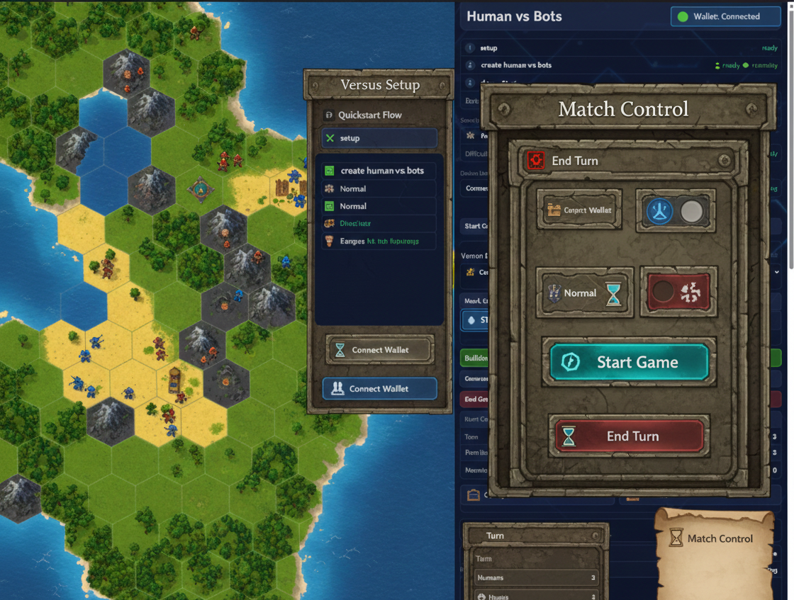

# Human-vs-bots

Turn-based strategy game with a Web3-ready flow on Stellar.

## What this project is

`Human-vs-bots` is a browser game with:

- Hex map battles (movement, attack, territory capture)
- Building-based production (human buildings vs bot tech core)
- Two battle modes:
  - **Human vs LLM**
  - **LLM vs LLM** simulation
- Popular LLM profiles as opponents with visible difficulty labels
- Side drawer UI, map zoom, and tactical match stats

## Run locally (direct game entry)

From repo root:

```bash
python3 -m http.server 4180 --directory /workspaces/Human-vs-bots
"$BROWSER" http://127.0.0.1:4180/
```

Root (`/`) redirects directly to the game.

Main game route:

- `demo/zemeroth-demo/index.html`

Alternative prototype route:

- `demo/civ-lite/index.html`

## Gameplay overview

- Select mode: **Human vs LLM** or **LLM vs LLM**
- Choose models and map difficulty
- Start match, control turns, produce units, and capture land
- Win by elimination or territory dominance

## LLM opponents currently available

- Claude 3.5 Sonnet (Hard)
- Claude 3 Opus (Very Hard)
- Clawbot v2 (Medium)
- OpenAI GPT-4o (Hard)
- OpenAI GPT-4.1 mini (Medium)
- OpenAI o1-mini (Very Hard)

## Web3 / ZK flow in the demo

UI includes:

- Wallet connection
- Match lifecycle (`start_game`, turn progression, `end_game`)
- Proof snapshot generation and export (`JSON`)

The flow is aligned with Stellar hackathon architecture and is prepared for deeper contract integration.

## Screenshots

> Add the screenshots you shared under `docs/screenshots/` using the filenames below.




## Useful scripts

- `scripts/serve-demos.sh`
- `scripts/serve-zemeroth.sh`
- `scripts/serve-civ-lite.sh`
- `scripts/game-studio.sh`

## Third-party references and licenses

- Unciv assets inspiration (visual assets used in demo pipeline)
- Zemeroth reference integration path
- Stellar/Game Studio quickstart alignment

License files in repo root:

- `THIRD_PARTY_UNCIV_LICENSE.txt`
- `THIRD_PARTY_ZEMEROTH_LICENSE_MIT.txt`
- `THIRD_PARTY_ZEMEROTH_LICENSE_APACHE.txt`
- `THIRD_PARTY_STELLAR_LICENSE.txt`
